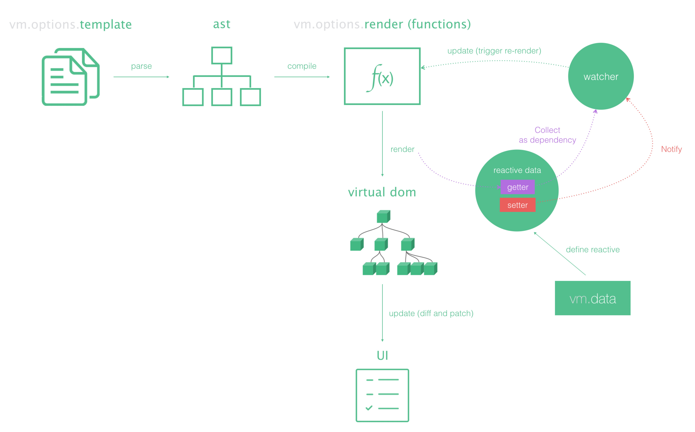

## Vue.js 2.0 basic concepts

下面这张图从宏观上展现了 Vue.js 2.0 整体流程图

从这张图中，我们可以初步看到一个 Vue.js 的应用是如何运行起来的，模版通过编译生成 ast，再由 ast 生成 Vue.js 的渲染函数，渲染函数结合数据生成 virtual dom tree，diff 和 patch 后生成新的 UI。

下面分别表述一些关于 Vue.js 的基本概念。

1. 模版

Vue.js 的模版基于纯 html，基于 Vue 的模版语法，我们可以比较方便地声明数据和 UI 的关系。

2. AST (Abstract syntax tree)

AST 是抽象语法树的简称，Vue.js 使用 html parser 将 html 模版解析为 ast，并且对 ast 进行一些优化的标记处理，提取最大的静态树，方便 virtual dom 时直接跳过 diff.

3. 渲染函数

渲染函数是用来生成 virtual dom 的。Vue.js 推荐使用模版来构建我们的应用界面，在底层实现中 Vue 会将模版编译成渲染函数，当然我们也可以不写模版，直接写渲染函数，以获得更好的控制。

4. Virtual dom

虚拟 dom 树，Vue.js 的 virtual dom patching 算法是基于 https://github.com/paldepind/snabbdom 的实现，并在此基础上作了很多的调整和改进。

5. Watcher

每一个 Vue.js 组件都有一个对应的 watcher，这个 watcher 将会在组件 render 的时候收集组件所依赖的数据，并在依赖有更新的时候，触发组件重新渲染。你根本不需要写 shouldComponentUpdate，Vue.js 会自动优化并更新需要更新的 UI。

Render function 可以作为一道分割线，Render function 的左边可以称之为编译期，将 Vue.js 的模版转换为渲染函数。Vue.js 2.0 对于 jsx 语法的支持即是通过 babel 插件编译实现。Render function 的右边是 Vue.js 的运行时，主要是基于渲染函数生成 virtual dom 树，diff & patch。

下面一篇我们将会详细介绍 Vue.js 的编译期，通过 parser 对模版进行解析生成 ast。